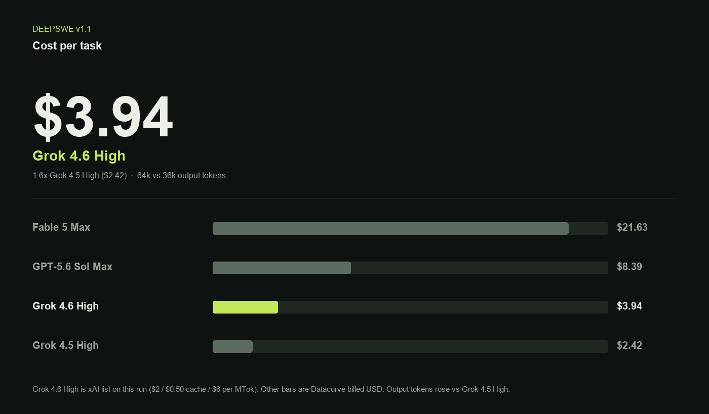

# Grok 4.6 High independent bench

Independent DeepSWE v1.1 and Terminal-Bench v3.0 runs of **Grok 4.6 High**, checked against the [xAI 2026-08-12 card](https://x.ai/news/grok-4-6). High is the effort level on that card; it is the only level used here.

## DeepSWE v1.1

xAI lists **65.9%**. This re-run: **65.5%** (72/110 graded; 3 tasks still in infra retry).

Pass rate is not a cost win. At xAI list ($2 / $0.50 cache / $6 per MTok) this run is **$3.94/task** vs Datacurve **$2.42** for Grok 4.5 High — about **1.6x** — and output tokens rose **64k vs 36k**.

| Model | pass@1 | USD / task |
| --- | ---: | ---: |
| GPT-5.6 Sol Max | 73% | $8.39 |
| Fable 5 Max | 70% | $21.63 |
| Grok 4.6 High (this run) | 65.5% | $3.94 (list, this run) |
| Grok 4.5 High | 54% | $2.42 |

Comparator pass and USD rows are Datacurve board scores. Grok 4.6 High is this Pier/Docker run on the 113-task set.

## Terminal-Bench v3.0

xAI lists **26%**. Same model, Harbor `terminal-bench/terminal-bench@latest` (74 tasks). Results land in `terminal-bench-v3-grok-4.6.json` when that job finishes.

## Method

- DeepSWE: Pier 0.3.1, Docker, 113 tasks from `datacurve-ai/deep-swe`
- Terminal-Bench: Harbor, Docker, dataset `@latest` as of 2026-08-12
- Machine: Apple M5 Max, Docker Desktop 28 GB / 18 CPU
- Pass rate is graded-only. Infra timeouts are not scored as model fails.
