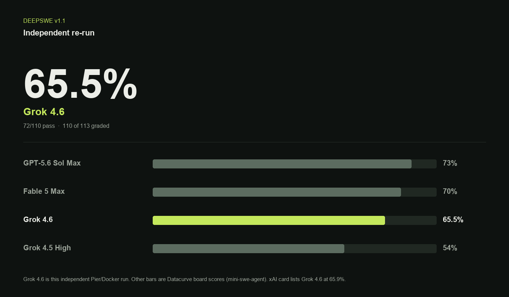

# Grok 4.6 independent bench

Independent DeepSWE v1.1 and Terminal-Bench v3.0 runs of **Grok 4.6**, checked against the [xAI 2026-08-12 card](https://x.ai/news/grok-4-6).

## DeepSWE v1.1

xAI lists **65.9%**. This re-run: **65.5%** (72/110 graded; 3 tasks still in infra retry).

| Model | pass@1 |
| --- | ---: |
| GPT-5.6 Sol Max | 73% |
| Fable 5 Max | 70% |
| Grok 4.6 (this run) | 65.5% |
| Grok 4.5 High | 54% |

Comparator rows are Datacurve board scores. Grok 4.6 is this Pier/Docker run on the 113-task set.

## Terminal-Bench v3.0

xAI lists **26%**. Same model, Harbor `terminal-bench/terminal-bench@latest` (74 tasks). Results land in `terminal-bench-v3-grok-4.6.json` when that job finishes.

## Method

- DeepSWE: Pier 0.3.1, Docker, 113 tasks from `datacurve-ai/deep-swe`
- Terminal-Bench: Harbor, Docker, dataset `@latest` as of 2026-08-12
- Machine: Apple M5 Max, Docker Desktop 28 GB / 18 CPU
- Pass rate is graded-only. Infra timeouts are not scored as model fails.
