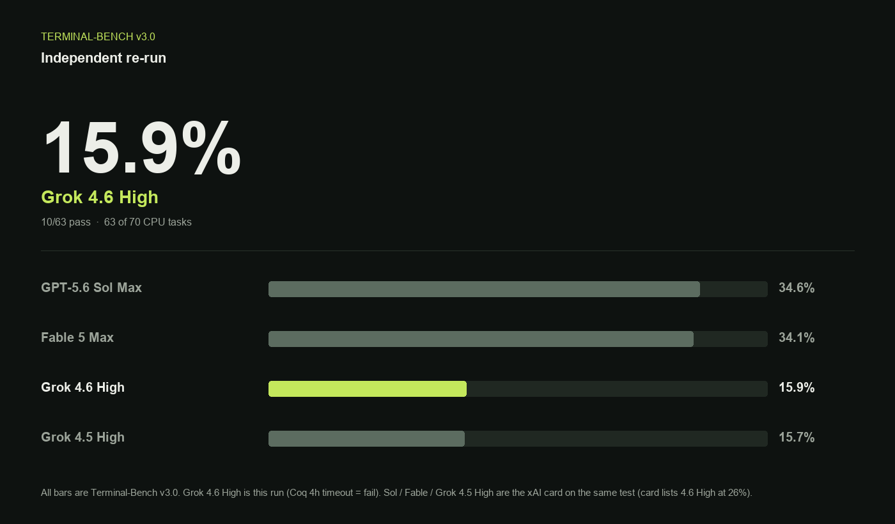
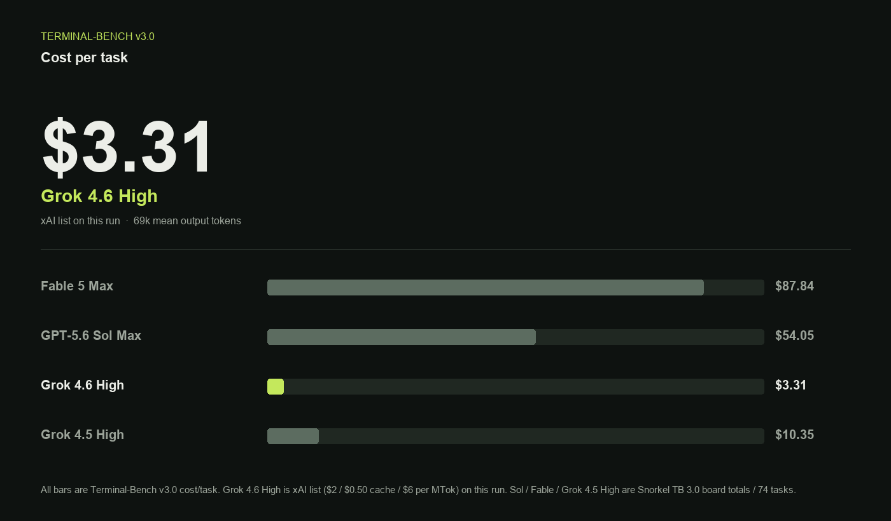

# Grok 4.6 High independent bench

Independent DeepSWE v1.1 and Terminal-Bench v3.0 runs of **Grok 4.6 High**, checked against the [xAI 2026-08-12 card](https://x.ai/news/grok-4-6). High is the effort level on that card; it is the only level used here.

## DeepSWE v1.1

xAI lists **65.9%**. This re-run: **64.6%** (73/113).

Pass rate is not a cost win. At xAI list ($2 / $0.50 cache / $6 per MTok) this run is **$3.96/task** vs Datacurve **$2.42** for Grok 4.5 High — about **1.6x** — and output tokens rose **64k vs 36k**.

| Model | pass@1 | USD / task |
| --- | ---: | ---: |
| GPT-5.6 Sol Max | 73% | $8.39 |
| Fable 5 Max | 70% | $21.63 |
| Grok 4.6 High (this run) | 64.6% | $3.96 (list, this run) |
| Grok 4.5 High | 54% | $2.42 |

Comparator rows are Datacurve DeepSWE v1.1 board scores. Grok 4.6 High is this Pier/Docker run on the 113-task set.

## Terminal-Bench v3.0

xAI lists **26%**. This re-run: **15.9%** (10/63 graded; Coq 4h timeout counted as a fail; 4 GPU tasks excluded; a few Docker/infra leftovers unresolved). That is a 10-point hole vs the card and only a hair above the card’s **15.7%** Grok 4.5 High number.

| Model | pass@1 |
| --- | ---: |
| GPT-5.6 Sol Max | 34.6% |
| Fable 5 Max | 34.1% |
| Grok 4.6 High (this run) | 15.9% |
| Grok 4.5 High | 15.7% |

Comparator rows are the xAI card on Terminal-Bench v3.0. JSON: `terminal-bench-v3-grok-4.6.json`.

## Method

- DeepSWE: Pier 0.3.1, Docker, 113 tasks from `datacurve-ai/deep-swe`
- Terminal-Bench: Harbor, Docker, `terminal-bench` v3.0.0 (74 tasks; 4 GPU excluded on this machine)
- Machine: Apple M5 Max, Docker Desktop 28 GB / 18 CPU
- Pass rate is graded-only except Coq, which is counted as a fail after a 4-hour agent timeout
- Do not copy these numbers into a Puppetmaster capability registry as earned Grok 4.6 High / Grok Build scores
